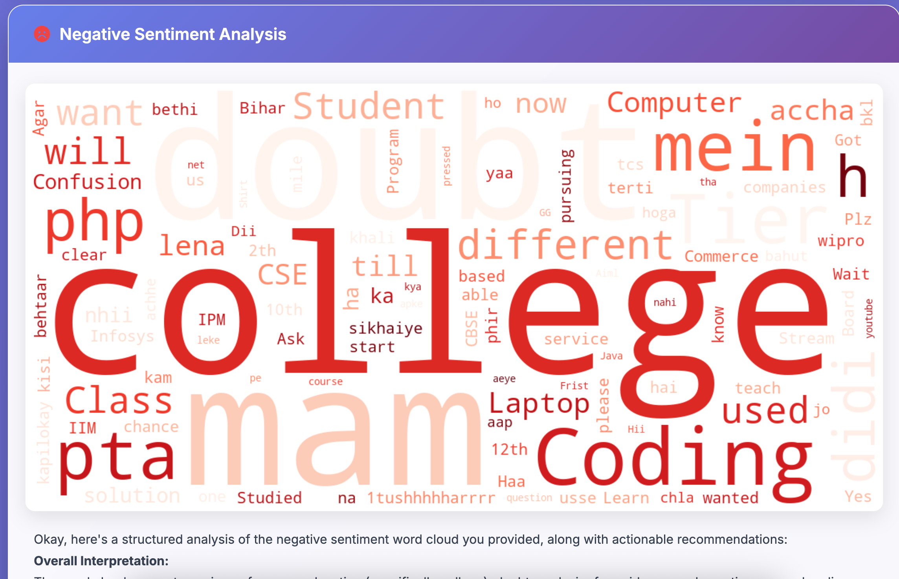
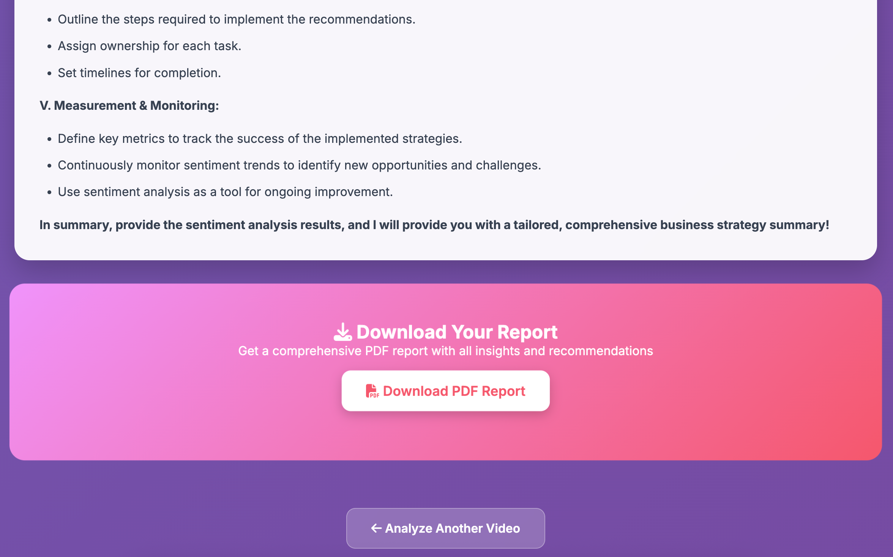

# YouTube Sentiment Analyzer Pro

Transform YouTube comments into actionable business insights with AI-powered sentiment analysis.

## Features

- **AI-Powered Sentiment Analysis**: Uses advanced machine learning models to analyze YouTube comments.
- **Visual Word Clouds**: Generates word clouds for positive, negative, and neutral sentiments.
- **Comprehensive PDF Reports**: Download detailed analytics and recommendations.
- **Interactive Web UI**: Modern, responsive FastAPI frontend.
- **Custom Stopwords & Focus Questions**: Tailor your analysis for specific insights.

## Requirements

See [requirements.txt](requirements.txt) for all dependencies.

## Installation

```sh
pip install -r requirements.txt
```

## Usage

1. Start the server:

    ```sh
    python main.py
    ```

2. Open your browser and go to [http://127.0.0.1:9000](http://127.0.0.1:9000).

3. Enter a YouTube video URL, optional stopwords, and your analysis question.

4. View results and download the PDF report.

## Example Output Images

Below are sample images generated by the app (located in the `static` folder):







## Project Structure

- `main.py`: Main FastAPI application.
- `requirements.txt`: Python dependencies.
- `static/`: Generated images and PDF reports.

## Notes

- Requires valid Hugging Face and Gemini API keys (set as environment variables).
- Only public YouTube videos with comments are supported.

## API Key Security

**Do not hardcode your API keys in `main.py`.**  
Instead, set them as environment variables before running the app:

```sh
export GEMINI_API_KEY="your-gemini-api-key"
export HF_API_TOKEN="your-huggingface-api-token"
```

The code will automatically read these keys using `os.getenv()`.

## License

MIT License